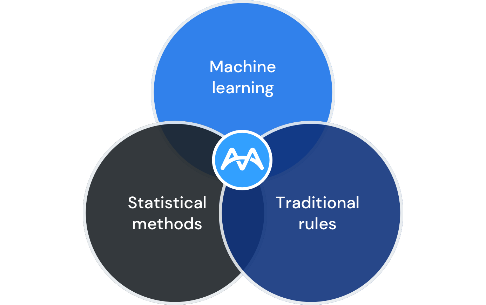
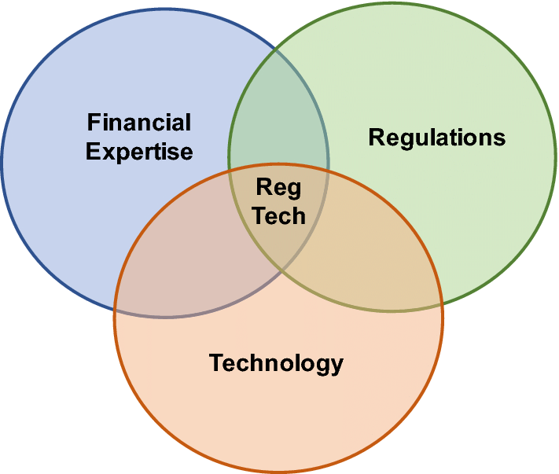

# MindBridge Analytics a new Ottawa base RegTech company.

## Overview and Origin

**MindBridge Analytics Inc.** is Ottawa based company which was founded on **Mar 15, 2015** by *Solon Angel*. Solon holds an MSc in Business Administration and Management from the Leonard de Vinci Management School (EMLV) in Paris and a Masters Certificate in Project Management from Carleton University. After years of frustration, Solon founded MindBridge to address the gaps in the industry with the available solutions in the fraud and financial analytics space.

 

Cuurently MindBridge is a Private Equity company and it is funded by 12 investors and has raised a total of **$102.3M** in funding  over 4 rounds. Their latest funding was raised on Jul 25, 2023 from a Private Equity round. The most recent investors are PSG Equity and Real Ventures.

## Business Activities

MindBridge is a platform that uses machine learning and artificial intelligence to identify and analyze risks in financial datasets. It detects anomalous patterns of activities, unintentional errors, and intentional financial misstatements. The MindBridge AI Auditor can help organizations across multiple industries minimize financial loss.

The company's intended customers are auditors and financial professionals, and it was able to work with some of the biggest accounting firms in the industry, like KPMG and MNP, over the short period that it existed. Also, the company is targeting enterprises to provide solutions for internal financial reporting.

Although there are other analytics companies like Maroon.ai and Deduce, MindBridge is uniquely designed for auditors and financial professionals to analyze data. According to the management, its solution identifies patterns in the general ledger, payables, receivables, vendors, revenue, or custom data sets.

MindBridge is utilizing various technologies and it’s engaging machine learning, natural language processing, and AI. It is actively using 37 technologies for its website, according to BuiltWith. These include Viewport Meta, IPhone / Mobile Compatible, and Apple Mobile Web Clips Icon.

## Landscape

MindBridge Analytics Inc. is the RegRech domain, and it aims to create an AI platform for auditing and detecting anomalous patterns of activities, unintentional errors, and intentional financial misstatements. For example, accounting firms can use the platform to ensure that their assurance engagements comply with their governing bodies' requirements. Also, to ensure that the Accepted Accounting Principles were followed when a set of financial statements were created. The platform will ensure that accounting firms and enterprises comply with the regulations while saving time and resources.

 

    

RegTech technologies address different types of regulatory needs. for example, cloud-based software programs that automate aspects of compliance. Financial institutions are investing heavily in RegTech, in terms of capital invested; according to some sources, their funding grew from **USD 923.4 million in 2014 to USD 4,484.5 million in 2018**.

There are multiple similar companies in this domain that are in competition with MindBridge like maroon.ai, Deduce, EigenPatterns, Zoomi, and others.

## Results

Although the company is somewhat new to the market, it has disrupted the audit and assurance industry. It caught the attention of KPMG, which is one of the big four accounting firms in the world and also MNP, a big accounting firm in Canada. On April 2023, Audit and advisory service provider KPMG partnered with MindBridge in order to bring AI-based services into KPMG member firms’ digital audits worldwide. Depending on the adoption of the platform and future customer feedback, this company may forever change how assurance engagements are conducted globally.

New startups in the RegTech domain use the investor types, partnerships signed, and funds collected in each stage as metrics to measure success. In every metrices mentioned, MindBridge, has either achieved significant success or doing very well compared to its competitors. For example, as stated previously it has partnered with KPMG, a well-known and global leader in Audit and advisory service provider. Researches show that most RegTech companies solve problems faced by incumbents, resulting in a greater willingness to engage in conversations and partnerships. Therefore, in terms of partnerships, MindBridge has achieved a lot. Also, the fact that 12 investors have invested millions of dollars in the company shows that they strongly believe in its management, solutions, and technologies.

## Recommendations

In the future, one area that the company can expand to is providing similar services to individuals. For example, complying with regulations when filing Tax returns is a challenge that faces ordinary citizens when filing their annual tax returns.

If MindBridge creates a new platform that helps individuals comply with government regulations and error detection, it will be able to expand its clientele and generate more revenue. Also, it may become a world leader in providing these kinds of services. If provided the company can utilize machine learning, AI, and Big Data to develop the new service.

##### References:
* <https://www.mindbridge.ai/>
* <https://www.crunchbase.com/>
* <https://thepaypers.com/online-mobile-banking/kpmg-partners-with-mindbridge--1262323>
* <https://selleo.com/blog/regtech-solutions-in-a-nutshell>

